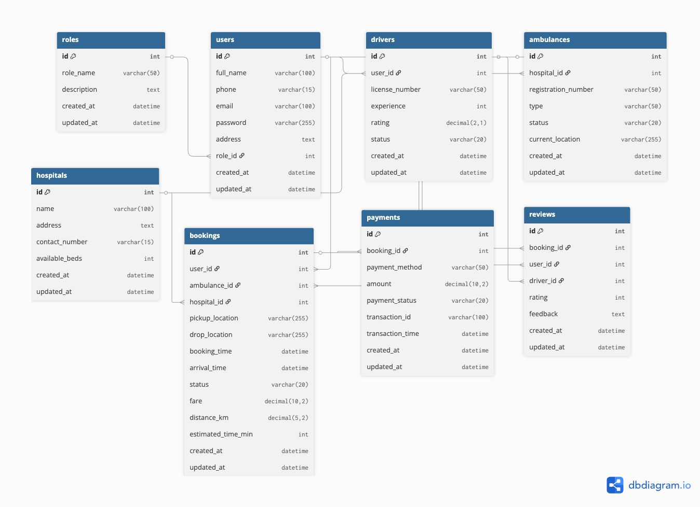

# 🚑 AMBUGO - Ambulance Booking System

The **Ambulance Booking System** is a **Next.js-based web application** designed to streamline ambulance booking and emergency response coordination.  
It allows patients and drivers to interact in real-time through a **secure, intuitive, and responsive platform**, ensuring faster medical assistance during emergencies.  

The frontend connects seamlessly with the backend via **REST APIs and Socket.io**, providing **real-time driver tracking, instant booking updates, and live trip status monitoring**.


[👉 Know More](https://docs.google.com/document/d/1PusiJMiwpYbAUpjTGTYunxlPW24cd9GQwjgiNjclx7k/edit?tab=t.0#heading=h.namad6nbwei0)
---

## 💻 Overview

- 🧭 **Two Interfaces:** Client Panel & Driver Panel  
- 🚑 **Clients:** Book ambulances, track drivers, and view booking history  
- 👨‍✈️ **Drivers:** Log in, view assigned trips, and update trip statuses  
- ⚡ **Real-time tracking & communication:** Powered by Socket.io & Google Maps API  
- 💬 **Responsive design:** Optimized for both web and mobile users  

---

## ⚙️ Key Features

### 🔐 Authentication System
**Client Authentication (OTP-based)**
- Login using mobile number  
- OTP via Firebase Authentication  
- JWT issued upon verification  

**Driver Authentication (Email + Password)**
- Secure login with hashed passwords (**bcrypt**)  
- JWT-based authentication & route protection  

---

### 🚗 Booking Management
- Clients can book ambulances with pickup & destination details  
- System finds the **nearest available driver**  
- Real-time trip updates: *Requested → Accepted → In Progress → Completed → Cancelled*  
- Booking history stored for both clients and drivers  

---

### 💬 Real-time Communication
- Powered by **Socket.io**  
- Real-time updates for:  
  - Trip status changes  
  - Driver location updates  
  - Notifications for acceptance, arrival, or cancellations  

---

### 🧾 Admin Capabilities (Optional)
- View all bookings and statuses  
- Manage driver accounts  
- Monitor system analytics  

---



---

## 🧰 Tech Stack

### **Frontend**
| Technology               | Purpose                                  |
|--------------------------|-----------------------------------------|
| **Next.js (React Framework)** | Core frontend framework                  |
| **Axios**                | API communication                        |
| **Socket.io Client**     | Real-time updates between client & driver|
| **Google Maps API**      | Location tracking and map integration    |
| **Tailwind CSS**         | Styling and responsive layout management |

### **Backend**
| Technology                   | Purpose                                      |
|-------------------------------|---------------------------------------------|
| **Node.js**                   | JavaScript runtime for backend              |
| **Express**                   | Web framework for building REST APIs        |
| **express-validator**         | Validate incoming request data              |
| **jsonwebtoken (JWT)**        | Authentication and route protection         |
| **cors**                      | Enable cross-origin requests                |
| **bcrypt**                    | Secure password hashing                      |
| **Prisma**                    | ORM for SQL database management             |

---

## 📜 API Documentation

### ⚡ Socket.io Events
- **booking request** → Triggered by client to request an ambulance  
- **booking accept** → Sent by driver upon accepting a booking  
- **location update** → Continuously transmits driver’s live location  
- **trip status emits** → Booking progress and completion updates  

---

## 🛠️ Full Setup & Installation Guide

### 1️⃣ Prerequisites
- **Node.js** (v16 or later) → [Download Node.js](https://nodejs.org/)  
- **npm** (comes with Node.js)  
- **Git** → [Download Git](https://git-scm.com/)  
- **SQL Database** (PostgreSQL/MySQL)  
- **MongoDB** → for NoSQL storage  
- Optional: **Postman** for testing APIs  

---

### 2️⃣ Clone the Repository
```bash
git clone https://github.com/praggCode/AMB_One.git
cd AMB_One


3️⃣ Install Dependencies
Install all required packages using npm:
npm install

Backend Setup
3️⃣ Navigate to Backend
cd backend


4️⃣ Install Dependencies
npm install


5️⃣ Run Backend Server
npm run dev

Frontend Setup
8️⃣ Navigate to Frontend
cd ../frontend

9️⃣ Install Dependencies
npm install


11️⃣ Run Frontend Server
npm run dev
```

### 🧪 Testing Guide ###

To verify the system’s functionality:
* ✅ Test client OTP login using Firebase
* ✅ Test driver login using email & password
* ✅ Create and manage ambulance bookings
* ✅ Monitor real-time booking status and driver tracking
* ✅ Validate responsiveness across devices
* ✅ Test Socket.io event flow (booking request → accept → complete)

### 🌐 Backend Integration ###

 * Frontend communicates with backend via /api/... routes
Uses Socket.io for instant updates between drivers and clients
Implements JWT-based authentication for secure requests

### 🧱 Future Enhancements ###

 * 📍 Advanced route optimization for drivers
 * 💳 Online Payment Integration (Razorpay / Stripe)
 * 🏥 Hospital Dashboard for centralized booking management
 * 🔊 Voice Alerts for driver notifications
 * 📱 Mobile App version (React Native / Flutter)


---

